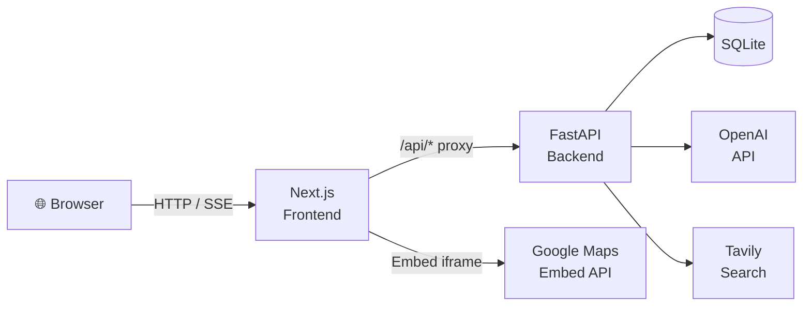

# 甜蜜食記 Sweet Food Diary

<p align="center">
  
</p>

甜蜜食記是一個為情侶設計的美食規劃系統，核心概念是「她規劃、他執行」。
系統把日常最常見的問題「今天要吃什麼」拆成可操作的流程：先用 AI 協助找方向，再用地圖探索店家、把喜歡的店收藏起來，最後安排進共享日曆，讓兩個人都能看到接下來的用餐計畫。

目前專案採用前後端分離架構：

- 前端：Next.js + React + TypeScript
- 後端：FastAPI + SQLAlchemy
- 資料庫：SQLite 為目前開發預設
- AI：OpenAI + LangGraph

---

## 畫面預覽

### App Demo

<p align="center">
  
</p>

### 登入畫面

<p align="center">
  
</p>

### 角色設定

<p align="center">

| 她 · La Princesse | 他 · Le Prince |
|:---:|:---:|
|  |  |
| **美食規劃者** | **美食執行者** |
| 搜尋餐廳・管理收藏・安排日曆 | 查看安排・配合執行・AI 諮詢 |

</p>

---

## 系統在做什麼

這不是單純的餐廳列表網站，也不是一般記事本。
它是一個把「美食決策、收藏、規劃、對話建議」整合在一起的情侶協作系統，主要解決以下情境：

- 不知道今天要吃什麼，需要快速獲得建議
- 想把看到的餐廳先存起來，之後再安排
- 需要一個雙方都看得到的三餐規劃頁面
- 希望依照不同角色看到不同權限與操作內容
- 想用 AI 對話來輔助選餐、收藏與安排日曆

## 這套系統設計給誰

主要目標使用者是情侶，尤其適合以下族群：

- 由其中一方負責規劃行程、挑選餐廳的人
- 由另一方負責配合執行、查看安排的人
- 喜歡先收藏餐廳，之後再挑日期安排的人
- 想用對話式方式取得餐廳建議的人

系統目前明確分成兩個角色：

- `her`：美食規劃者，可登入後管理日曆、收藏、地圖探索與 AI 對話
- `him`：美食執行者，可查看日曆、查看收藏、使用 AI 對話

## 核心設計概念

- 角色分流：前端路由與後端 API 權限都依角色區分
- 共享資訊：雙方看的是同一份日曆與收藏資料
- her 可寫、him 多為唯讀：真正的寫入保護在後端
- 對話驅動：AI 不只是聊天，也會參與收藏分類與規劃流程
- Mobile-first：介面明顯偏向手機使用情境

## 主要功能

### 1. 登入與角色辨識

系統登入後會依照使用者角色導向不同路由：

- `her` 進入 `/her/calendar`
- `him` 進入 `/him/calendar`

目前後端在啟動時會自動建立兩組開發用帳號：

- `公主 / her123`
- `王子 / him123`

登入驗證使用 JWT，並以 `httpOnly Cookie` 保存，不直接暴露給前端 JavaScript。

### 2. 共享美食日曆

日曆是系統核心功能之一，以早餐、午餐、晚餐三個餐別為單位管理。

- her 可新增、修改、刪除餐點安排
- him 可查看既有安排
- 同一天同一餐只允許一筆資料，後端採 upsert 邏輯更新
- 前端提供月曆視圖與單日明細互動

使用方式：

1. 登入後進入日曆頁
2. her 點日期後可編輯餐廳名稱、地址、備註
3. him 點日期後可查看當天三餐安排

### 3. 地圖探索

地圖頁使用 Google Maps Embed API，讓使用者直接輸入關鍵字搜尋店家。

- her 可在地圖中搜尋餐廳
- her 可從地圖頁直接加入收藏
- him 目前可查看地圖與收藏側欄，但不提供新增收藏入口

使用方式：

1. 進入地圖頁
2. 輸入搜尋關鍵字，例如 `台北市餐廳`
3. 透過 Google Maps 觀看結果
4. her 可點擊「加入收藏」

### 4. 收藏清單與分類資料夾

收藏功能不只是單純清單，而是依分類分組顯示。
後端在建立收藏時，會透過 AI 工具自動幫餐廳分類。

- 可取得 flat list，供地圖側欄使用
- 可取得 grouped list，供收藏頁資料夾模式使用
- her 可新增、刪除、重新分類
- him 可查看收藏內容

使用方式：

1. her 從地圖頁或未來 AI 流程中加入收藏
2. 系統自動判斷分類
3. 收藏頁依分類資料夾顯示各餐廳
4. 可從收藏項目開啟加入日曆流程

### 5. AI 美食顧問

系統內建 AI 對話功能，依角色有不同語氣與定位：

- her 使用「糖糖」人格，語氣較貼心
- him 使用「阿哲」人格，語氣較務實

AI 功能目前包含：

- 根據需求推薦今天吃什麼
- 使用 SSE 串流方式回傳內容
- 維持對話 session 與歷史紀錄
- 使用 LangGraph 管理 agent state
- 可串接工具做餐廳分類、收藏、搜尋與安排流程

前端聊天紀錄目前會另外存放在瀏覽器端，用於切換聊天 session。

## 典型使用流程

### her 的使用流程

1. 登入系統
2. 到地圖頁搜尋餐廳
3. 把喜歡的店加入收藏
4. 到收藏頁查看 AI 自動分類結果
5. 把餐廳加入某一天的早餐、午餐或晚餐
6. 到聊天頁和 AI 討論今天適合吃什麼

### him 的使用流程

1. 登入系統
2. 查看日曆，確認近期要吃什麼
3. 到收藏頁或地圖頁看已收集的餐廳
4. 到聊天頁詢問建議或補充資訊

## 系統架構

### 架構總覽

```text
Browser
  -> Next.js Frontend
  -> API Proxy / Route Handler
  -> FastAPI Backend
  -> SQLite
  -> OpenAI / LangGraph / Tavily
```

### 前端架構

前端位於 `frontend/`，主要採用 Next.js App Router。

- `app/login`：登入頁
- `app/her/*`：her 角色頁面
- `app/him/*`：him 角色頁面
- `components/`：共用 UI 與功能元件
- `hooks/`：認證、日曆、收藏、聊天等資料邏輯
- `lib/api.ts`：Axios 設定，統一攜帶 Cookie
- `app/api/agent/chat/route.ts`：將聊天串流轉發到後端

前端的重要設計：

- 使用 `RoleGuard` 在頁面層做角色導向
- 使用 React Query 管理日曆與收藏資料請求
- 使用 Next.js rewrite 將 `/api/*` 代理到 FastAPI
- 使用底部導覽列切換主要功能頁

### 後端架構

後端位於 `backend/`，結構接近標準分層式設計。

- `main.py`：FastAPI 入口與 router 掛載
- `routers/`：API 路由層
- `services/`：業務邏輯層
- `repositories/`：資料存取層
- `models/`：SQLAlchemy ORM 模型
- `schemas/`：Pydantic request/response schema
- `core/`：設定、資料庫、安全機制
- `middleware/`：角色權限守衛
- `services/agent/`：LangGraph agent、prompt、tools、state

後端目前掛載的 API 模組：

- `/api/auth`
- `/api/calendar`
- `/api/favorites`
- `/api/agent`
- `/api/health`

### 資料流說明

#### 登入流程

1. 前端呼叫 `/api/auth/login`
2. 後端驗證帳號密碼
3. 後端寫入 JWT 到 `httpOnly Cookie`
4. 前端依回傳角色導向對應頁面

#### 日曆流程

1. 前端以年月讀取 `/api/calendar`
2. 後端回傳該月份所有餐點資料
3. her 編輯時送出 `PUT /api/calendar`
4. him 雖可讀取，但無法通過 her-only 寫入權限

#### 收藏流程

1. her 建立收藏時呼叫 `POST /api/favorites`
2. 後端先呼叫分類工具判斷 `category`
3. 寫入資料庫後，前端刷新收藏與分組畫面

#### AI 對話流程

1. 前端送出 `/api/agent/chat`
2. Next.js route handler 轉發到後端
3. FastAPI 以 SSE 串流回傳內容
4. LangGraph 依角色與狀態執行對話流程

## 系統流程圖

### 使用者操作流程

```mermaid
flowchart TD
    A([使用者開啟 App]) --> B[Landing Page]
    B --> C[登入頁 · 選擇角色]
    C --> D{角色驗證}
    D -->|her| E[/her/calendar]
    D -->|him| F[/him/calendar]

    E --> G[📅 日曆管理]
    E --> H[🗺️ 地圖探索]
    E --> I[❤️ 收藏清單]
    E --> J[💬 AI 對話 · 糖糖]

    F --> K[📅 查看日曆]
    F --> L[❤️ 查看收藏]
    F --> M[💬 AI 對話 · 阿哲]

    G -->|新增/修改餐點| N[(SQLite DB)]
    H -->|加入收藏| I
    I -->|安排到日曆| G
    J -->|工具呼叫| I
    J -->|工具呼叫| G
```

### 資料流架構



---

## State Management

專案採用分層狀態管理，不同類型的狀態由不同機制負責：

### 1. 伺服器狀態 — TanStack Query

日曆、收藏等需要與後端同步的資料，統一使用 **TanStack Query (React Query)** 管理：

| Hook | Query Key | 說明 |
|---|---|---|
| `useCalendar(year, month)` | `["calendar", year, month]` | 月份餐點資料，含快取與自動失效 |
| `useFavorites()` | `["favorites"]` | 收藏 flat list |
| `useFavoritesGrouped()` | `["favorites", "grouped"]` | 收藏分組資料 |
| `useUpsertMealPlan()` | mutation → invalidate calendar | 新增/更新餐點 |
| `useDeleteMealPlan()` | mutation → invalidate calendar | 刪除餐點 |

### 2. 認證狀態 — React Context

登入身份與角色資訊由 `AuthProvider` 統一管理，全站透過 `useAuth()` 取用：

```
AuthProvider
  ├── isLoggedIn: boolean
  ├── role: "her" | "him" | null
  ├── isLoading: boolean
  └── login() / logout()
```

JWT token 儲存於後端寫入的 `httpOnly Cookie`，前端不直接持有 token。

### 3. 聊天狀態 — useState + localStorage

AI 對話採用本地狀態管理，不經過 React Query：

- `messages` / `isStreaming` — `useState` 管理目前對話畫面
- `activeThreadId` — 以 `useRef` 在 SSE 非同步回呼中安全存取
- **Session 歷史** — 透過 `lib/chatHistory.ts` 序列化存入 `localStorage`，支援多 session 切換

### 4. 狀態層架構總覽

```
QueryClientProvider          ← TanStack Query 全域快取
  └── AuthProvider           ← JWT 認證 Context
        └── Page Components
              ├── useCalendar / useFavorites   ← 伺服器狀態
              ├── useAuth                      ← 認證狀態
              └── useChat                      ← 本地 + localStorage
```

---

## 主要資料模型

### `users`

- `id`
- `role`
- `nickname`
- `password_hash`
- `created_at`

### `meal_plans`

- `id`
- `user_id`
- `plan_date`
- `meal_type`
- `restaurant_name`
- `address`
- `note`
- `created_at`
- `updated_at`

特性：

- `(plan_date, meal_type)` 有唯一限制
- 同一日期同一餐別會採更新而非重複新增

### `favorites`

- `id`
- `user_id`
- `restaurant_name`
- `address`
- `maps_url`
- `category`
- `category_tags`
- `created_at`

## API 概覽

### Auth

- `POST /api/auth/login`
- `POST /api/auth/logout`
- `GET /api/auth/me`

### Calendar

- `GET /api/calendar?year=YYYY&month=MM`
- `PUT /api/calendar`
- `DELETE /api/calendar/{plan_id}`

### Favorites

- `GET /api/favorites`
- `GET /api/favorites/grouped`
- `POST /api/favorites`
- `PATCH /api/favorites/reclassify`
- `DELETE /api/favorites/{favorite_id}`

### Agent

- `POST /api/agent/chat`
- `GET /api/agent/state`

## 目錄結構

```text
Tsai_PIG/
├─ backend/
│  ├─ alembic/
│  ├─ core/
│  ├─ middleware/
│  ├─ models/
│  ├─ repositories/
│  ├─ routers/
│  ├─ schemas/
│  ├─ services/
│  │  └─ agent/
│  ├─ tests/
│  ├─ main.py
│  ├─ requirements.txt
│  └─ Dockerfile
├─ frontend/
│  ├─ app/
│  ├─ components/
│  ├─ hooks/
│  ├─ lib/
│  ├─ public/
│  ├─ types/
│  ├─ package.json
│  └─ Dockerfile
├─ docker-compose.yml
├─ sweet_food_diary_plan.md
└─ README.md
```

## 開發環境需求

建議版本：

- Node.js 20+
- Yarn 1.x
- Python 3.11 以上
- SQLite

如果要使用完整 AI 與地圖功能，還需要：

- OpenAI API Key
- Google Maps Embed API Key
- 可選的 Tavily API Key

## 環境變數

### 後端

後端 `Settings` 目前會讀取以下變數：

- `OPENAI_API_KEY`
- `LLM_MAIN`
- `LLM_NANO`
- `DATABASE_URL`
- `JWT_SECRET`
- `JWT_ALGORITHM`
- `JWT_EXPIRE_MINUTES`
- `GOOGLE_MAPS_API_KEY`
- `TAVILY_WEBSEARCH_API_KEY`
- `ENV`

### 前端

前端目前使用到：

- `API_URL`
- `NEXT_PUBLIC_GOOGLE_MAPS_API_KEY`

## 啟動方式

### 方式一：本機開發啟動

這是目前最穩定、也最符合專案現況的啟動方式。

#### 1. 啟動後端

```bash
cd backend
pip install -r requirements.txt
uvicorn main:app --reload --host 0.0.0.0 --port 8000
```

#### 2. 啟動前端

```bash
cd frontend
yarn install
yarn dev
```

#### 3. 開啟系統

- 前端：`http://localhost:3000`
- 後端：`http://localhost:8000`
- 後端文件：`http://localhost:8000/docs`

### 方式二：Docker / docker-compose

專案目前已有：

- `backend/Dockerfile`
- `frontend/Dockerfile`
- 根目錄 `docker-compose.yml`

但目前 Docker 啟動流程仍屬於初步版本，文件與部署細節還沒有完全補齊，因此建議先以本機開發模式為主。

目前狀態說明：

- 已有基礎 Dockerfile
- `docker-compose.yml` 已定義前後端服務
- 仍建議在後續版本補齊更完整的容器化說明、正式環境設定與啟動驗證

可先保留為未來版本補強項目：

- 補完整的 Docker 使用說明
- 補齊正式環境 env 範本
- 補齊資料庫持久化與 migration 流程說明
- 補齊 production build 與部署策略

## 測試

後端目前已有測試檔案，包含：

- `backend/tests/test_auth.py`
- `backend/tests/test_calendar.py`
- `backend/tests/test_agent.py`

測試內容以角色保護、日曆 service/repository、AI prompt 組裝為主。

若要執行，可在後端環境安裝依賴後使用：

```bash
cd backend
pytest
```

## 目前已完成與尚待補強

### 已完成

- 前後端基本結構已建立
- 角色登入與 Cookie 驗證已建立
- 日曆 CRUD 已建立
- 收藏 CRUD 與分組查詢已建立
- 地圖頁與收藏側欄已建立
- AI 對話串流基礎已建立
- LangGraph agent 結構已建立
- 基本測試檔已存在

### 尚待補強

- 根目錄專案文件原本不足，已於本次補上
- Docker 文件與完整容器化流程尚未完善
- 正式環境部署說明尚未完成
- 需要補更完整的 `.env.example`
- 可再補前端測試與 E2E 測試
- 部分規劃文件中的進階功能仍屬後續迭代項目

## 注意事項

- 寫入權限以後端角色檢查為準，不能只相信前端畫面限制
- AI、Google Maps、Tavily 相關功能都依賴外部 API 金鑰
- 若缺少 OpenAI API Key，部分收藏分類或 AI 對話功能會受影響
- 若缺少 Google Maps Key，地圖嵌入功能無法正常顯示

## 後續建議

- 新增 `.env.example` 與安裝腳本
- 補正式版 Docker / compose 文件
- 增加 PostgreSQL 切換教學
- 增加權限矩陣與 API 範例 request/response

---

這份 README 以目前專案實作內容為主，並已明確標註 Docker 與部署文件仍在補強中，適合作為現在的專案主文件與後續擴充基礎。
